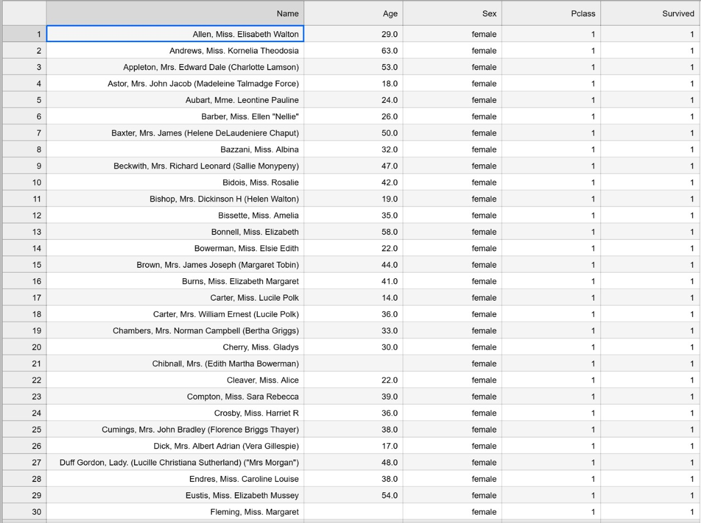

# DS_TitanicProject

Projeto para estudos de Data Science utilizando Python.

## Sobre 

Este projeto tem como objetivo analisar os dados do Titanic utilizando bibliotecas populares de Data Science em Python: Pandas, Numpy e Matplotlib. O dataset utilizado é o famoso Titanic dataset, contendo informações sobre os passageiros, como se sobreviveram ou não, classe do passageiro, nome, sexo e idade. 

## Dataset

O dataset `titanic.csv` possui as seguintes colunas:
- PassengerId: Identificador do passageiro
- Survived: Indicador se o passageiro sobreviveu (1) ou não (0)
- Pclass: Classe do passageiro (1 = 1ª classe, 2 = 2ª classe, 3 = 3ª classe)
- Name: Nome do passageiro
- Sex: Sexo do passageiro
- Age: Idade do passageiro
- Outras 6 que não foram utilizadas

## Tarefas

1. Exportar um novo arquivo CSV com as seguintes colunas na ordem: Nome (em ordem alfabética), Idade, Sexo, Classe e Se Sobreviveu.
2. Filtrar os dados apenas para mulheres.
3. Filtrar os dados apenas para a primeira classe.
4. Filtrar os dados apenas para os sobreviventes.

## Screenshots



## Passos para Instalação

1. **Clone o repositório**

    ```sh
    git clone https://github.com/victordscabral/DS_TitanicProject.git
    ```

2. **Navegue até o diretório do projeto**

    ```sh
    cd DS_TitanicProject
    ```

3. **Crie um ambiente virtual (opcional, mas recomendado)**

    ```sh
    python3 -m venv env
    source env/bin/activate  # Para Linux
    .\env\Scripts\activate  # Para Windows
    ```

4. **Instale as dependências**

    ```sh
    pip install pandas numpy matplotlib jupyterlab
    ```

5. **Inicie o Jupyter Lab**

    ```sh
    jupyter lab
    ```

## Uso

1. Abra o arquivo `titanic_analysis.ipynb` no Jupyter Lab.
2. Execute as células para carregar e analisar os dados do Titanic.
